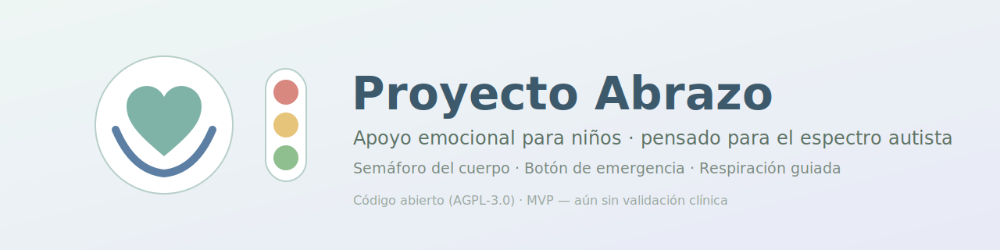

<p align="center"></p>

# 🫂 Proyecto Abrazo

[](https://github.com/marianomarcuchi2025/proyecto-abrazo/actions/workflows/ci.yml)
[](LICENSE)
[](#️-estado-del-proyecto)

"Millones de niños tienen dificultades para expresar cómo se sienten. Proyecto Abrazo busca ofrecer herramientas abiertas, accesibles y transparentes para acompañar la regulación emocional de forma segura."

**App web de apoyo emocional para niños** — pensada especialmente para niños en el espectro autista. Incluye un "semáforo del cuerpo" para registrar cómo se sienten, un botón de emergencia que avisa a uno o dos adultos de confianza, y respiración guiada. Diseñada siguiendo guías publicadas de diseño accesible para autismo (GOV.UK, W3C COGA).

> **English:** An open-source web app to help children — especially autistic children — regulate their emotions: a "body traffic light" for emotional check-ins, an emergency button that alerts one or two trusted adults, and guided breathing. Built following published autism-friendly design guidelines (GOV.UK autism design poster, W3C COGA). **Status: MVP / prototype — not clinically validated yet.** Contributions from clinicians, accessibility experts and developers are very welcome.

---

## ⚠️ Estado del proyecto

**Esto es un MVP / prototipo. NO está validado clínicamente ni auditado de seguridad de forma independiente. No lo uses todavía con familias reales sin que un profesional revise el flujo de emergencia.**

Este README describe únicamente lo que el código de este repositorio hace hoy, verificado ejecutando el build y los 26 tests automatizados — no hay planes de arquitectura sin construir presentados como si ya existieran. Para el detalle completo de bugs encontrados y corregidos en cada pasada de revisión, y sobre todo lo que **no** está resuelto todavía, ver [`AUDIT.md`](AUDIT.md).

## ✨ Qué hace

- 🚦 **Semáforo del cuerpo** — el niño registra su estado emocional (🙂 😐 🙁) con lenguaje visual simple y literal, sin metáforas.
- 🆘 **Botón de emergencia** — avisa a uno o dos adultos de confianza configurados previamente (todos los contactos configurados reciben el aviso, no solo el primero). La app solo confirma el envío cuando el servidor lo confirma de verdad por HTTP; el intento de SMS/WhatsApp desde el dispositivo es un canal adicional de mejor esfuerzo, nunca la fuente de verdad. Sin falsos "ya viene un abrazo".
- 📴 **Cola offline con confirmación tardía** — si el dispositivo no tiene conexión al activar la emergencia, el pedido se guarda cifrado localmente y se reintenta solo al recuperar conexión; cuando finalmente se entrega, la pantalla avisa que el mensaje salió (antes esto se perdía silenciosamente).
- 🌬️ **Respiración guiada** — ciclo simple (4-2-6) para "Ayúdame a calmarme", con soporte de `prefers-reduced-motion` para sensibilidad al movimiento.
- 💬 **"Quiero decir algo"** — set fijo de 6 símbolos [ARASAAC](https://arasaac.org) ("Tengo hambre", "Tengo sed", "Me duele", "Estoy cansado/a", "Necesito ir al baño", "Necesito estar solo/a"). El niño toca uno y se muestra grande para señalarlo o mostrárselo a un adulto — no es un editor de tableros completo, y no dispara ningún aviso de red propio. **Prototipo sin revisión clínica todavía** (ver `docs/REVISION_CLINICA_PENDIENTE.md`); requiere conexión a internet para cargar las imágenes (se cargan desde la CDN pública de ARASAAC, no están bundleadas en la app). Verificado visualmente en navegador el 2026-07-14: las 6 imágenes cargan correctamente.
- ♿ **Diseño autism-friendly** — lenguaje literal, vibración opt-in, colores de baja saturación, botones con texto (no solo color/emoji), mensajes de estado que no desaparecen solos. Basado en guía publicada (GOV.UK, W3C COGA) — hipótesis de diseño razonables, no validación clínica.

## 📥 Descargar y probar

**Opción 1 — Descarga directa (sin conocimientos de git):**

1. Andá a [Releases](https://github.com/marianomarcuchi2025/proyecto-abrazo/releases) y bajá el `.zip` de la última versión, **o** usá el botón verde **`<> Code` → `Download ZIP`** arriba a la derecha del repo.
2. Descomprimí el archivo.
3. Seguí los pasos de instalación de abajo.

**Opción 2 — Con git:**

```bash
git clone https://github.com/marianomarcuchi2025/proyecto-abrazo.git
cd proyecto-abrazo
```

## 🚀 Instalación y uso

Requisitos: [Node.js 20+](https://nodejs.org) y npm 10+. No hace falta Docker, Python ni ninguna base de datos externa — el MVP corre entero con Node.

```bash
npm install
npm run build          # compila los 3 paquetes (core, server, ui-nino)
npm test                # corre los 26 tests de core y server
npm run test:coverage   # mismos 26 tests + reporte de cobertura real (node --test --experimental-test-coverage)
npm run dev             # levanta ui-nino en :3000 y server en :3001 en paralelo
```

Abrí <http://localhost:3000> en el navegador. El servidor expone `GET /api/health` para verificar que está vivo.

**Cobertura real** (medida con `npm run test:coverage` el 2026-07-14, no una insignia — números exactos, uncovered lines incluidas en la salida del comando):

| Paquete | Líneas | Branches | Funciones |
| :--- | ---: | ---: | ---: |
| `core` | 90.64% | 84.25% | 87.67% |
| `server` | 93.47% | 71.74% | 80.82% |

`ui-nino` sigue sin tests automatizados (ver "Antes de considerar esto listo para familias reales" más abajo), así que no tiene número de cobertura — omitirlo de la tabla es intencional, no un olvido.

Por defecto el servidor arranca **sin autenticación** (imprime una advertencia). Para protegerlo con un API key compartido, ver `.env.example` — copiarlo a `.env`, generar un valor para `API_KEY` (y el mismo valor en `VITE_API_KEY` para que el frontend lo mande), y reiniciar.

## 🏗️ Estructura real

```
packages/
  core/      # Lógica de dominio (TypeScript puro, sin UI): semáforo, emergencia,
             # respiración guiada, storage cifrado (AES-GCM), cola de red offline-first.
  ui-nino/   # Interfaz web para el niño (Lit + Vite). Sin frameworks pesados.
  server/    # Backend (Express + helmet + rate-limit + auth opcional por API key).
             # Persiste en archivos JSON en disco (packages/server/data/), no en
             # memoria de proceso — sobrevive a reinicios. No es una base de
             # datos real (ver "Pendientes" y persistence.ts).
```

Monorepo con npm workspaces + Lerna. Sin `apps/`, `infra/` ni `packages/ui` genéricos: es exactamente lo de arriba, nada más.

## 🔒 Seguridad — qué hay y qué no

- El almacenamiento local del cliente usa **AES-GCM 256 real** vía Web Crypto API (no Base64). Límite honesto: la clave se guarda sin cifrar en el mismo storage porque no hay backend de autenticación de usuarios donde custodiarla — protege contra lectura casual, no contra acceso físico completo al dispositivo.
- El backend filtra recursivamente cualquier payload que contenga claves asociadas a datos biométricos (frecuencia cardíaca, HRV, audio, fotos, geolocalización exacta) y los rechaza con `400`.
- **Autenticación por API key compartido (opcional, recomendada):** si se configura `API_KEY`, todos los endpoints `/api/*` exigen `Authorization: Bearer <clave>` (comparación en tiempo constante). Es un único secreto por instancia desplegada, no cuentas de usuario ni identidad por dispositivo — protege un despliegue self-hosted de tráfico aleatorio de internet, no distingue qué familia mandó qué dato.
- **Persistencia en disco** (JSON con escritura atómica), ya no en un array en memoria que se perdía al reiniciar el proceso.
- CORS restringido por variable de entorno (`CORS_ORIGIN`); rate limiting activo en `/api/*`.
- **Lo que sigue sin existir:** cuentas de usuario, autenticación por dispositivo/familia, base de datos transaccional real, cumplimiento normativo formal para datos de menores (COPPA/GDPR-K). Ver [`SECURITY.md`](SECURITY.md) para reportar vulnerabilidades.

## 🤝 Cómo contribuir

Este proyecto necesita especialmente:

- **Profesionales clínicos** (terapistas ocupacionales, psicólogos infantiles) para revisar el flujo de emergencia y el lenguaje usado con niños en crisis.
- **Expertos en accesibilidad** para auditar contra WCAG y COGA.
- **Desarrolladores** para los pendientes listados abajo.

Ver [`CONTRIBUTING.md`](CONTRIBUTING.md). Issues y PRs bienvenidos, en español o inglés.

## 🗺️ Antes de considerar esto listo para familias reales

Esto es lo que un lanzamiento real necesitaría y que este MVP todavía no cubre:

- **Revisión clínica/de seguridad infantil** del flujo de emergencia, del lenguaje usado con niños en crisis, y ahora también de los 6 símbolos de "Quiero decir algo" (¿son las necesidades correctas? ¿el set de 6 alcanza?) — por parte de alguien con esa especialidad, no un LLM ni un desarrollador solo. Pedido puntual en `docs/REVISION_CLINICA_PENDIENTE.md`.
- **Notificación server-side real** (SMS/push con confirmación de entrega) en vez de depender del navegador del dispositivo del niño.
- **Cuentas/identidad por familia o dispositivo** — hoy la autenticación es un único API key por instancia, no distingue quién manda qué.
- **Cumplimiento normativo** para datos de menores (COPPA, GDPR-K o equivalente local) y una política de privacidad real.
- **Base de datos transaccional real** — hoy es persistencia en archivos JSON (sobrevive reinicios, pero sin transacciones ni concurrencia segura entre procesos).
- **Tests de interfaz (DOM) para `ui-nino`** — la lógica pura (respiración, dominio) tiene 26 tests entre `core` y `server`; los componentes Lit en sí (render, eventos de click) todavía no tienen tests automatizados.
- **Demo pública real** (capturas, video, deploy verificable) — todavía no existe; correr `npm run dev` localmente es, por ahora, la única forma de verla.
- Pruebas con usuarios reales (niños, cuidadores) antes de cualquier intento de distribución masiva.

## 📄 Licencia

[AGPL-3.0-only](LICENSE) — software libre: podés usarlo, modificarlo y redistribuirlo, siempre que las versiones modificadas (incluido su uso como servicio de red) también sean libres bajo la misma licencia.

## 📋 Changelog

Ver [`CHANGELOG.md`](CHANGELOG.md).

## 🙏 Referencias de diseño

- [GOV.UK — Designing for users on the autistic spectrum](https://ukhomeoffice.github.io/accessibility-posters/posters/accessibility-posters.pdf)
- [W3C — Cognitive and Learning Disabilities Accessibility (COGA)](https://www.w3.org/TR/coga-usable/)
