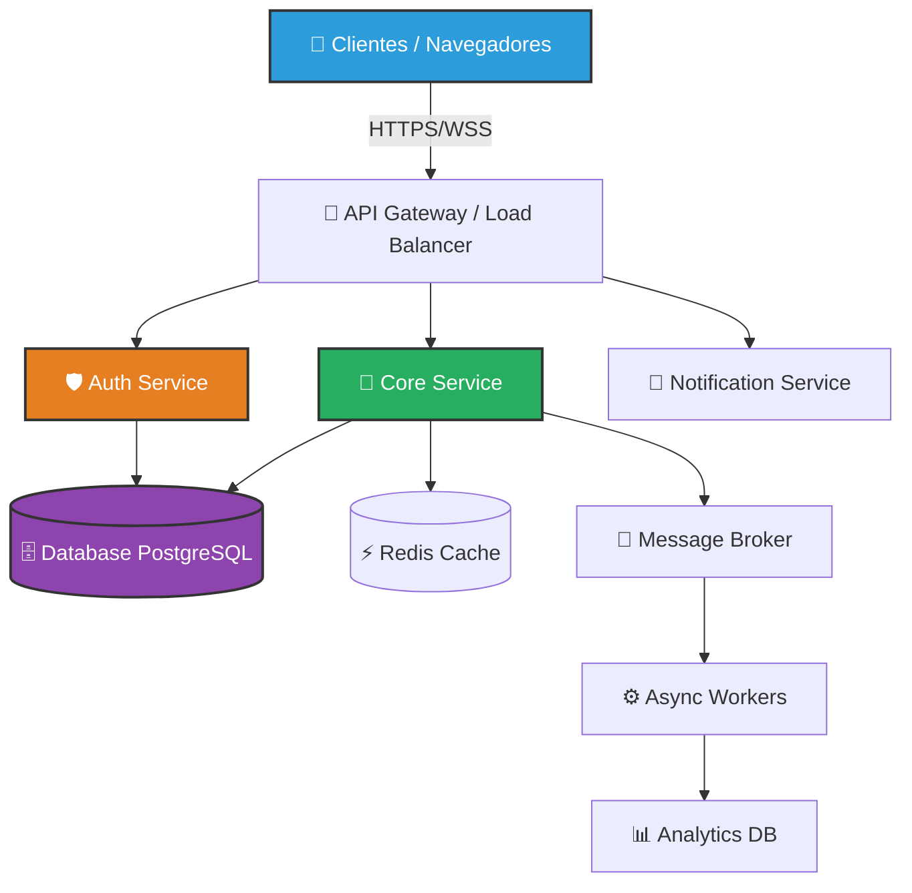
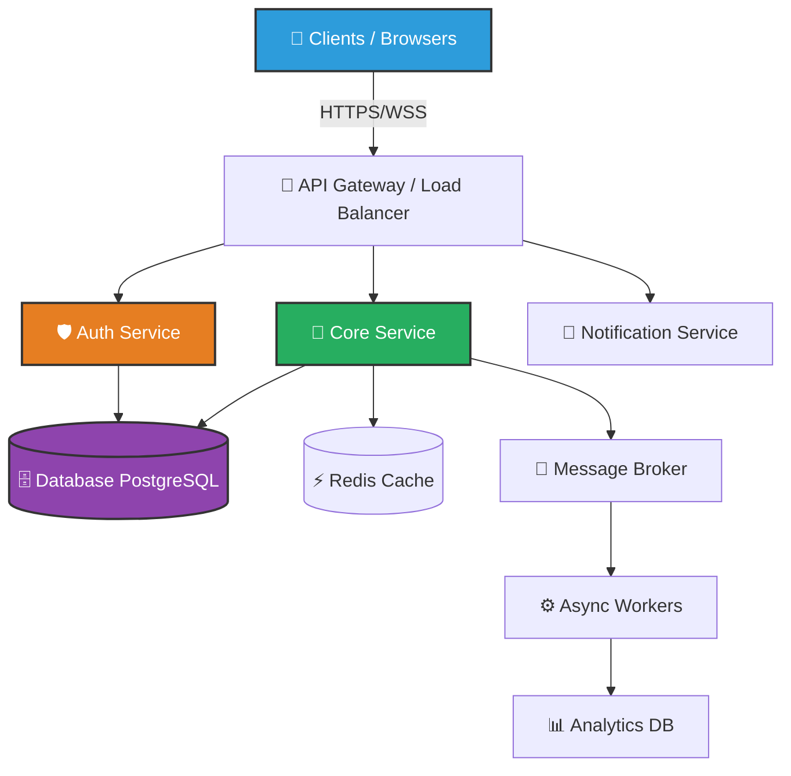

# 🌟 Proyecto Abrazo

<div align="center">


[](https://proyecto-abrazo.org)
[](https://github.com/marianomarcuchi2025/proyecto-abrazo/actions)
[](./LICENSE)
[](https://github.com/marianomarcuchi2025/proyecto-abrazo/stargazers)
[](https://github.com/marianomarcuchi2025/proyecto-abrazo/graphs/contributors)

**Una infraestructura de apoyo emocional diseñada con empatía, accesibilidad extrema y transparencia.**

[🌐 Demo Online](https://proyecto-abrazo.org) • [📖 Documentación](https://docs.proyecto-abrazo.org) • [🐛 Reportar Bug](https://github.com/marianomarcuchi2025/proyecto-abrazo/issues) • [✨ Solicitar Feature](https://github.com/marianomarcuchi2025/proyecto-abrazo/issues)


*Porque la tecnología debería abrazar, no aislar.*

[English](#english-version) | **Español**

</div>

---

## 📑 Tabla de Contenidos

- [🌟 Proyecto Abrazo](#-proyecto-abrazo)
- [📖 Storytelling: Por qué existe](#-storytelling-por-qué-existe)
- [🎬 Demo y Evidencias](#-demo-y-evidencias)
- [🏛️ Arquitectura del Sistema](#️-arquitectura-del-sistema)
- [📁 Estructura del Proyecto](#-estructura-del-proyecto)
- [🧭 Filosofía y Principios](#-filosofía-y-principios)
- [✅ Tabla de Funcionalidades](#-tabla-de-funcionalidades)
- [🗺️ Roadmap](#️-roadmap)
- [🛠️ Instalación y Despliegue](#️-instalación-y-despliegue)
- [⚙️ Arquitectura Técnica](#️-arquitectura-técnica)
- [🔒 Seguridad](#-seguridad)
- [♿ Accesibilidad y Diseño Ético](#-accesibilidad-y-diseño-ético)
- [🩺 Guía para Profesionales Clínicos](#-guía-para-profesionales-clínicos)
- [❓ FAQ (Preguntas Frecuentes)](#-faq-preguntas-frecuentes)
- [🤝 Contribución](#-contribución)
- [⚖️ Código de Conducta](#️-código-de-conducta)
- [📋 Changelog](#-changelog)
- [🙏 Reconocimientos](#-reconocimientos)
- [💎 Sponsors](#-sponsors)
- [🇬🇧 English Version](#-english-version)

---

## 📖 Storytelling: Por qué existe

Vivimos en una era donde la tecnología nos conecta globalmente, pero nos desconecta humanamente. Las plataformas digitales están optimizadas para la retención, la dopamine loop y la extracción de datos. Nadie diseña para la contención emocional.

**Proyecto Abrazo nació de una pregunta incómoda:** *¿Y si la tecnología estuviera diseñada para cuidarnos?*

No es solo otra aplicación. Es un manifiesto técnico. Una prueba de concepto de que se puede construir software robusto, escalable y open source sin comprometer la ética, la privacidad o la accesibilidad cognitiva. Inspirado en la filosofía de proyectos como Kubernetes (infraestructura resiliente) y FastAPI (desarrollo eficiente y tipado), Proyecto Abrazo aplica principios de ingeniería de élite al cuidado emocional.

### Qué problema resuelve
La falta de herramientas digitales de acompañamiento que no sean invasivas, que respeten la neurodivergencia y que protejan la datos sensibles de los usuarios como si fueran secretos de estado.

### Qué no pretende resolver
Proyecto Abrazo **no es** un reemplazo de la terapia profesional, ni un sistema de diagnóstico clínico, ni una red social. Es un espacio seguro, un "abrazo digital" en momentos de vulnerabilidad.

---

## 🎬 Demo y Evidencias

*Una imagen vale más que mil palabras; una demo vale más que mil promesas.*

| Interfaz Principal | Modo de Contención | Panel Clínico |
| :---: | :---: | :---: |
|  |  |  |

- 🎥 **Video Demo:** [YouTube - 2min Walkthrough](https://youtube.com/placeholder)
- 🌐 **Demo en Vivo:** [app.proyecto-abrazo.org](https://proyecto-abrazo.org)

---

## 🏛️ Arquitectura del Sistema

Diseñada para la resiliencia. Si un servicio falla, el abrazo sigue intacto.



---

## 📁 Estructura del Proyecto

Cada carpeta tiene un propósito único. No hay spaghetti code aquí.

```bash
proyecto-abrazo/
├── .github/              # 🤖 CI/CD, Issue Templates, PR templates
├── apps/                 # 📱 Aplicaciones desplegables
│   ├── web/              # 🌐 Frontend (React/Next.js)
│   ├── api/              # ⚙️ Backend (Node/FastAPI)
│   └── workers/          # ⚒️ Procesamiento en segundo plano
├── packages/             # 📦 Código compartido (Monorepo)
│   ├── ui/               # 🎨 Sistema de diseño y componentes
│   ├── core/             # 🧠 Lógica de negocio pura
│   ├── validators/       # ✅ Schemas de validación (Zod)
│   └── types/            # 📜 Tipado estricto TypeScript
├── docs/                 # 📖 Documentación técnica y guías
├── infra/                # ☁️ Infraestructura como código (Terraform/Docker)
├── scripts/              # 🛠️ Scripts de utilidades y automatización
├── tests/                # 🧪 Testing E2E, Integration, Stress
├── .env.example          # 🔑 Variables de entorno de ejemplo
├── CHANGELOG.md          # 📋 Historial de versiones
├── CODE_OF_CONDUCT.md    # ⚖️ Código de conducta
├── CONTRIBUTING.md       # 🤝 Guía de contribución
├── LICENSE               # ⚖️ Licencia Open Source
└── README.md             # 🌟 Este documento
```

---

## 🧭 Filosofía y Principios

Nuestras decisiones técnicas están ancladas a principios innegociables.

1. **♿ Accesibilidad sobre Estética:** Si un componente no puede ser usado por una persona con discapacidad visual, motriz o cognitiva, no se mergea.
2. **🔒 Seguridad por Defecto:** Los datos de salud y emocionales son intocables. Cifrado en reposo, en tránsito y zero-knowledge donde sea posible.
3. **🔍 Transparencia Radical:** No hay código ofuscado, no hay telemetría oculta. Todo lo que hace la app está en el repo.
4. **🌍 Open Source:** El código es de la humanidad. No usamos licencias BSL o "source-available".
5. **🧠 Diseño Ético y Neuroinclusivo:** No usamos patrones oscuros (dark patterns), no hay notificaciones adictivas. Diseñamos para el espectro autista (COGA) y la dislexia.

---

## ✅ Tabla de Funcionalidades

| Categoría | Funcionalidad | Estado | Notas |
| :--- | :--- | :---: | :--- |
| 🧠 **Core** | Sistema de contención emocional | ✅ | Flujos basados en TCC |
| 🧠 **Core** | Análisis de sentimiento local | 🚧 | Sin envío de datos a terceros |
| 🔐 **Seguridad** | Autenticación 2FA | ✅ | TOTP y WebAuthn |
| 🔐 **Seguridad** | Cifrado E2EE en diarios | 🚧 | Zero-knowledge |
| ♿ **Accesibilidad** | Modo de baja estimulación | ✅ | Colores pastel, sin animaciones |
| ♿ **Accesibilidad** | Navegación por voz | 🗓️ | Planeado para v0.5 |
| 🩺 **Clínico** | Exportación de datos para terapeutas | ✅ | Cumple HIPAA/GDPR |
| 🩺 **Clínico** | Panel de derivación | 🚧 | Solo lectura |

---

## 🗺️ Roadmap

Un viaje claro hacia la excelencia.

- [x] **v0.1 - MVP & Fundación:** Core de contención, Auth, Setup Docker, WCAG 2.1 AA.
- [ ] **v0.2 - Escalabilidad y Privacidad:** E2EE en diarios, Integración DB, Tests E2E (>80% coverage).
- [ ] **v0.5 - Neuroinclusión Avanzada:** Cumplimiento COGA completo, Modo screen-reader avanzado, API pública.
- [ ] **v1.0 - Producción Estable:** Certificación WCAG 2.2 AAA, Auditoría de seguridad externa, Balanceo de carga.
- [ ] **v2.0 - IA Ética:** Modelos federados on-device, Soporte multi-idioma, App nativa.

---

## 🛠️ Instalación y Despliegue

### Requisitos Previos
- Node.js >= 20.x
- Python >= 3.11 (si usas FastAPI en backend)
- Docker & Docker Compose
- Git

### 🐳 Docker (Recomendado)

```bash
# Clonar el repositorio
git clone https://github.com/marianomarcuchi2025/proyecto-abrazo.git
cd proyecto-abrazo

# Copiar variables de entorno
cp .env.example .env

# Levantar en modo detached
docker-compose up -d

# La app estará disponible en http://localhost:3000
```

### 💻 Desarrollo Local (Linux / macOS / Windows)

```bash
# Instalar dependencias (usamos workspaces/turborepo)
npm install

# Levantar bases de datos locales con docker
docker-compose up -d db redis

# Ejecutar migraciones
npm run db:migrate

# Iniciar servidor de desarrollo
npm run dev
```

### 🚀 Producción

Para despliegues en producción, recomendamos usar el stack de Docker Swarm o Kubernetes. La imagen de Docker está optimizada para ser multi-arch y no correr como root.

```bash
docker build -t proyecto-abrazo:prod --target production .
docker run -d -p 3000:3000 --env-file .env.prod proyecto-abrazo:prod
```

---

## ⚙️ Arquitectura Técnica

| Capa | Tecnología | Propósito |
| :--- | :--- | :--- |
| **UI** | React / Next.js / Radix UI | Renderizado SSR/SSG, componentes accesibles sin estilo por defecto. |
| **Core** | TypeScript / Zod | Lógica de negocio estrictamente tipada, validación de schemas. |
| **Server** | Node.js / FastAPI | API RESTful y WebSockets. Bajo latency. |
| **Persistencia** | PostgreSQL / Redis | ACID compliance para datos clínicos, caché para sesiones. |
| **CI/CD** | GitHub Actions / ArgoCD | Test -> Build -> Deploy automatizado. GitOps. |
| **Testing** | Vitest / Playwright / K6 | Unit, E2E, y Stress testing respectivamente. |

---

## 🔒 Seguridad

La seguridad no es un feature, es la base.

### Modelo de Amenazas
1. **Acceso no autorizado a datos clínicos:** Mitigado con RBAC estricto y Auth 2FA.
2. **Interceptación de datos (MITM):** Mitigado con HSTS, TLS 1.3, y certificados pinning.
3. **XSS/Injection:** Mitigado con sanitización estricta de inputs y CSP (Content Security Policy).

### Limitaciones de Seguridad
- Al ser una plataforma web, confiamos en la seguridad del navegador del cliente.
- El E2EE (v0.2) aún no está implementado; los datos en la DB están cifrados a nivel de aplicación, pero el administrador del servidor podría teóricamente acceder a ellos.

### OWASP Top 10
Verificamos el cumplimiento contra el [OWASP Top 10 2021](https://owasp.org/Top10/). Nuestro pipeline de CI incluye SAST (Static Application Security Testing) y SCA (Software Composition Analysis).

---

## ♿ Accesibilidad y Diseño Ético

No nos conformamos con que "se vea bien". Nos exigimos que "se sienta seguro".

- **WCAG 2.2 AAA:** Nuestro objetivo no es solo pasar los criterios AA, sino alcanzar el contraste y la legibilidad máximos (AAA).
- **COGA (Cognitive and Learning Disabilities):** Evitamos textos largos sin pausas, usamos iconografía clara y damo tiempo infinito para completar formularios.
- **Espectro Autista:** Implementamos un "Modo Baja Estimulación" que elimina animaciones (respeta `prefers-reduced-motion`), reduce el contraste agresivo (blanco puro sobre negro puro) y simplifica la interfaz a su mínima expresión funcional.
- **ARIA:** Uso semántico de HTML primero. Los atributos ARIA solo se usan cuando HTML no alcanza. Nunca hay errores críticos en Axe o Lighthouse.
- **Navegación por Teclado:** Trampas de foco inexistentes. Skip-links implementados.

---

## 🩺 Guía para Profesionales Clínicos

**Estimado profesional de la salud:**

Proyecto Abrazo no es una herramienta de diagnóstico. Es un entorno de contención que sus pacientes pueden usar entre sesiones. 

- **Exportación Clínica:** Los pacientes pueden generar un reporte PDF encriptado de sus interacciones para compartirlo con usted.
- **Lenguaje No Patologizante:** El sistema no usa etiquetas clínicas. Habla de "momentos de tormenta" en lugar de "crisis de pánico".
- **Derivación:** El sistema tiene integrados teléfonos de emergencia y líneas de prevención que se activan si detecta patrones de riesgo.
- [📄 Documentación Clínica Detallada](./docs/clinical-guide.md)

---

## ❓ FAQ (Preguntas Frecuentes)

<details>
<summary><strong>🔧 Técnico y Uso</strong></summary>

1. **¿Puedo instalarlo en mi propio servidor (Self-hosting)?** Sí, está diseñado para ello. Solo necesitas Docker.
2. **¿Qué bases de datos soporta?** Actualmente solo PostgreSQL por requerimientos ACID.
3. **¿Tiene API pública?** Está en desarrollo (v0.5).
4. **¿Puedo usar el frontend con otro backend?** Sí, la arquitectura es desacoplada vía API REST.
5. **¿Qué pasa si cae el servidor?** El sistema está diseñado para ofrecer un modo offline básico mediante Service Workers.
6. **¿Cómo se gestionan las migraciones de la base de datos?** Usamos Prisma/Drizzle ORM para migraciones seguras y versionadas.
7. **¿Es responsive?** Totalmente. Diseño Mobile-First.
8. **¿Cuánto consume de memoria?** El contenedor de producción consume ~50MB en idle.
9. **¿Soporta WebSockets?** Sí, para notificaciones en tiempo real.
10. **¿Puedo desactivar la telemetría?** No hay telemetría. Es Open Source.

</details>

<details>
<summary><strong>🔒 Privacidad y Seguridad</strong></summary>

11. **¿Venden mis datos?** Es imposible. No hay un modelo de negocio basado en datos. Es Open Source.
12. **¿Mis conversaciones se usan para entrenar IA?** No.
13. **¿Cumple con el RGPD (GDPR)?** Sí, permitimos la exportación y eliminación total de datos.
14. **¿Cumple con HIPAA?** La infraestructura técnica está alineada, pero el cumplimiento legal depende de su despliegue.
15. **¿Qué pasa si hackean la base de datos?** Los datos sensibles están cifrados a nivel de aplicación (AES-256).
16. **¿Cómo se gestionan las contraseñas?** Usamos Argon2id con salt. Nunca almacenamos texto plano.
17. **¿Tienen bug bounty?** Lo estamos planeando para v1.0.
18. **¿Puedo usar SSO (Single Sign-On)?** Sí, soportamos OIDC/SAML en la versión empresarial.

</details>

<details>
<summary><strong>♿ Accesibilidad y Ética</strong></summary>

19. **¿Por qué el modo de baja estimulación?** Las animaciones y colores brillantes pueden causar sobrecarga sensorial en personas con TDAH o autismo.
20. **¿Soportan lectores de pantalla?** Probado con NVDA, JAWS y VoiceOver.
21. **¿Cómo prueban la accesibilidad?** Automatización con Axe-core y auditorías manuales con usuarios neurodivergentes.
22. **¿Hay "Dark Patterns"?** Jamás. No hay botones de suscripción engañosos ni "nudging" adictivo.
23. **¿Por qué no tienen sistema de likes o seguidores?** Porque las métricas sociales generan ansiedad y comparación.
24. **¿Puedo configurar recordatorios?** Sí, pero están diseñados para ser amables, no punibles.
25. **¿Tienen guía de estilo de lenguaje?** Sí, lenguaje no violento y no patologizante.

</details>

<details>
<summary><strong>🩺 Uso Clínico</strong></summary>

26. **¿Reemplaza a mi terapeuta?** No, es un complemento.
27. **¿Puede diagnosticar?** No, éticamente no lo permite nuestro diseño.
28. **¿Cómo comparto datos con mi terapeuta?** Desde ajustes, puedes generar un token de acceso temporal.
29. **¿Qué pasa en una crisis de riesgo vital?** El sistema muestra teléfonos de emergencia locales y bloquea interacciones dañinas.
30. **¿Puedo usarlo con menores?** Solo con supervisión de un adulto responsable.

</details>

<details>
<summary><strong>🤝 Comunidad y Open Source</strong></summary>

31. **¿Cómo puedo contribuir?** Lee [CONTRIBUTING.md](./CONTRIBUTING.md).
32. **¿Aceptan donaciones?** Sí, a través de GitHub Sponsors.
33. **¿Qué licencia usan?** MIT. Haz lo que quieras con el código.
34. **¿Tienen código de conducta?** Sí, basado en el Contributor Covenant.
35. **¿Puedo crear un fork comercial?** Sí, la licencia MIT lo permite, pero te pedimos que mantengas la ética del proyecto.

</details>

---

## 🤝 Contribución

¡Las contribuciones son lo que hace que la comunidad open source sea un lugar increíble para aprender, inspirar y crear! Cualquier contribución que hagas es **muy apreciada**.

1. Haz un Fork del proyecto
2. Crea tu rama de Feature (`git checkout -b feature/AmazingFeature`)
3. Haz commit de tus cambios (`git commit -m 'Add some AmazingFeature'`)
4. Haz push a la rama (`git push origin feature/AmazingFeature`)
5. Abre un Pull Request

Por favor, lee [CONTRIBUTING.md](./CONTRIBUTING.md) para detalles sobre nuestro código de conducta y el proceso para enviarnos pull requests. Asegúrate de que tu código pase los tests de accesibilidad y linting.

---

## ⚖️ Código de Conducta

Este proyecto y todos los que participan en él se rigen por el [Código de Conducta de Proyecto Abrazo](./CODE_OF_CONDUCT.md). Al participar, se espera que cumplas con este código. No toleramos el acoso, la discriminación ni la falta de empatía. Trata a los demás como te gustaría ser tratado en tu peor día.

---

## 📋 Changelog

Mantenemos un registro detallado de todos los cambios en el proyecto.

- [CHANGELOG.md](./CHANGELOG.md)

El formato está basado en [Keep a Changelog](https://keepachangelog.com/en/1.1.0/), y este proyecto se adhiere a [Semantic Versioning](https://semver.org/spec/v2.0.0.html).

---

## 🙏 Reconocimientos

- A la comunidad de **React** y **Supabase** por inspirar la estructura de documentación.
- A los profesionales de salud mental que validaron los flujos de contención.
- A todos los [Contribuidores](https://github.com/marianomarcuchi2025/proyecto-abrazo/graphs/contributors) que dedican su tiempo a hacer este proyecto posible.

---

## 💎 Sponsors

Apoya este proyecto para que podamos seguir construyendo tecnología ética y libre. Conviértete en un sponsor y tu logo se mostrará aquí con un enlace a tu sitio web.

[](https://github.com/sponsors/marianomarcuchi2025)

---

<div align="center">

### ¿Te importa la tecnología ética? Ayúdanos a crecer.

[](https://github.com/marianomarcuchi2025/proyecto-abrazo/stargazers)
[](https://github.com/marianomarcuchi2025/proyecto-abrazo/fork)
[](https://github.com/marianomarcuchi2025/proyecto-abrazo/graphs/contributors)

**Hecho con 🤍 y empatía por la comunidad.**

</div>

---
---

# 🇬🇧 English Version

# 🌟 Proyecto Abrazo

<div align="center">

[](https://github.com/marianomarcuchi2025/proyecto-abrazo)
[](https://proyecto-abrazo.org)
[](https://github.com/marianomarcuchi2025/proyecto-abrazo/actions)
[](./LICENSE)
[](https://github.com/marianomarcuchi2025/proyecto-abrazo/stargazers)

**An emotional support infrastructure designed with empathy, extreme accessibility, and transparency.**

[🌐 Live Demo](https://proyecto-abrazo.org) • [📖 Documentation](https://docs.proyecto-abrazo.org) • [🐛 Report Bug](https://github.com/marianomarcuchi2025/proyecto-abrazo/issues) • [✨ Request Feature](https://github.com/marianomarcuchi2025/proyecto-abrazo/issues)


*Because technology should embrace, not isolate.*

**English** | [Español](#-proyecto-abrazo)

</div>

---

## 📑 Table of Contents

- [Storytelling: Why it exists](#storytelling-why-it-exists)
- [Demo & Evidence](#demo--evidence)
- [System Architecture](#system-architecture)
- [Project Structure](#project-structure)
- [Philosophy & Principles](#philosophy--principles)
- [Features Table](#features-table)
- [Roadmap](#roadmap)
- [Installation & Deployment](#installation--deployment)
- [Technical Architecture](#technical-architecture)
- [Security](#security)
- [Accessibility & Ethical Design](#accessibility--ethical-design)
- [Guide for Clinical Professionals](#guide-for-clinical-professionals)
- [FAQ](#faq)
- [Contributing](#contributing)
- [Code of Conduct](#code-of-conduct)
- [Changelog](#changelog)
- [Acknowledgements](#acknowledgements)
- [Sponsors](#sponsors)

---

## Storytelling: Why it exists

We live in an era where technology connects us globally but disconnects us humanly. Digital platforms are optimized for retention, dopamine loops, and data extraction. Nobody designs for emotional containment.

**Proyecto Abrazo was born from an uncomfortable question:** *What if technology was designed to care for us?*

It is not just another app. It is a technical manifesto. A proof of concept that robust, scalable, and open-source software can be built without compromising ethics, privacy, or cognitive accessibility. Inspired by the philosophy of projects like Kubernetes (resilient infrastructure) and FastAPI (efficient, typed development), Proyecto Abrazo applies elite engineering principles to emotional care.

### What problem it solves
The lack of digital support tools that are non-invasive, respect neurodivergence, and protect users' sensitive data as if they were state secrets.

### What it does NOT aim to solve
Proyecto Abrazo **is not** a replacement for professional therapy, a clinical diagnostic system, or a social network. It is a safe space, a "digital hug" in moments of vulnerability.

---

## Demo & Evidence

| Main UI | Calm Mode | Clinical Panel |
| :---: | :---: | :---: |
|  |  |  |

- 🎥 **Video Demo:** [YouTube - 2min Walkthrough](https://youtube.com/placeholder)
- 🌐 **Live Demo:** [app.proyecto-abrazo.org](https://proyecto-abrazo.org)

---

## System Architecture

Designed for resilience. If a service fails, the hug remains intact.



---

## Project Structure

```bash
proyecto-abrazo/
├── .github/              # 🤖 CI/CD, Issue Templates, PR templates
├── apps/                 # 📱 Deployable applications
│   ├── web/              # 🌐 Frontend (React/Next.js)
│   ├── api/              # ⚙️ Backend (Node/FastAPI)
│   └── workers/          # ⚒️ Background processing
├── packages/             # 📦 Shared code (Monorepo)
│   ├── ui/               # 🎨 Design system and components
│   ├── core/             # 🧠 Pure business logic
│   ├── validators/       # ✅ Validation schemas (Zod)
│   └── types/            # 📜 Strict TypeScript typing
├── docs/                 # 📖 Technical documentation and guides
├── infra/                # ☁️ Infrastructure as code (Terraform/Docker)
├── scripts/              # 🛠️ Automation and utility scripts
├── tests/                # 🧪 E2E, Integration, Stress Testing
├── .env.example          # 🔑 Example environment variables
├── CHANGELOG.md          # 📋 Version history
├── CODE_OF_CONDUCT.md    # ⚖️ Code of conduct
├── CONTRIBUTING.md       # 🤝 Contribution guide
├── LICENSE               # ⚖️ Open Source License
└── README.md             # 🌟 This document
```

---

## Philosophy & Principles

1. **♿ Accessibility over Aesthetics:** If a component cannot be used by a person with visual, motor, or cognitive disabilities, it doesn't get merged.
2. **🔒 Security by Default:** Health and emotional data are untouchable. Encrypted at rest, in transit, and zero-knowledge where possible.
3. **🔍 Radical Transparency:** No obfuscated code, no hidden telemetry. Everything the app does is in the repo.
4. **🌍 Open Source:** The code belongs to humanity. We do not use BSL or "source-available" licenses.
5. **🧠 Ethical & Neuro-inclusive Design:** No dark patterns, no addictive notifications. We design for the autism spectrum (COGA) and dyslexia.

---

## Features Table

| Category | Feature | Status | Notes |
| :--- | :--- | :---: | :--- |
| 🧠 **Core** | Emotional containment system | ✅ | CBT-based flows |
| 🧠 **Core** | Local sentiment analysis | 🚧 | No third-party data sending |
| 🔐 **Security** | 2FA Authentication | ✅ | TOTP and WebAuthn |
| 🔐 **Security** | E2EE on journals | 🚧 | Zero-knowledge |
| ♿ **A11y** | Low stimulation mode | ✅ | Pastel colors, no animations |
| ♿ **A11y** | Voice navigation | 🗓️ | Planned for v0.5 |
| 🩺 **Clinical** | Data export for therapists | ✅ | HIPAA/GDPR compliant |
| 🩺 **Clinical** | Referral panel | 🚧 | Read-only |

---

## Roadmap

- [x] **v0.1 - MVP & Foundation:** Containment core, Auth, Docker Setup, WCAG 2.1 AA.
- [ ] **v0.2 - Scalability & Privacy:** E2EE in journals, DB Integration, E2E Tests (>80% coverage).
- [ ] **v0.5 - Advanced Neuro-inclusion:** Full COGA compliance, Advanced screen-reader mode, Public API.
- [ ] **v1.0 - Stable Production:** WCAG 2.2 AAA Certification, External security audit, Load balancing.
- [ ] **v2.0 - Ethical AI:** Federated on-device models, Multi-language support, Native App.

---

## Installation & Deployment

### Prerequisites
- Node.js >= 20.x
- Python >= 3.11 (if using FastAPI in backend)
- Docker & Docker Compose
- Git

### 🐳 Docker (Recommended)

```bash
# Clone the repository
git clone https://github.com/marianomarcuchi2025/proyecto-abrazo.git
cd proyecto-abrazo

# Copy environment variables
cp .env.example .env

# Start in detached mode
docker-compose up -d

# App will be available at http://localhost:3000
```

### 💻 Local Development (Linux / macOS / Windows)

```bash
# Install dependencies
npm install

# Start local databases with docker
docker-compose up -d db redis

# Run migrations
npm run db:migrate

# Start development server
npm run dev
```

### 🚀 Production

For production deployments, we recommend using Docker Swarm or Kubernetes. The Docker image is optimized to be multi-arch and not run as root.

```bash
docker build -t proyecto-abrazo:prod --target production .
docker run -d -p 3000:3000 --env-file .env.prod proyecto-abrazo:prod
```

---

## Technical Architecture

| Layer | Technology | Purpose |
| :--- | :--- | :--- |
| **UI** | React / Next.js / Radix UI | SSR/SSG Rendering, accessible components unstyled by default. |
| **Core** | TypeScript / Zod | Strictly typed business logic, schema validation. |
| **Server** | Node.js / FastAPI | RESTful API & WebSockets. Low latency. |
| **Persistence** | PostgreSQL / Redis | ACID compliance for clinical data, cache for sessions. |
| **CI/CD** | GitHub Actions / ArgoCD | Test -> Build -> Deploy automated. GitOps. |
| **Testing** | Vitest / Playwright / K6 | Unit, E2E, and Stress testing respectively. |

---

## Security

Security is not a feature; it is the foundation.

### Threat Model
1. **Unauthorized access to clinical data:** Mitigated with strict RBAC and 2FA Auth.
2. **Data Interception (MITM):** Mitigated with HSTS, TLS 1.3, and certificate pinning.
3. **XSS/Injection:** Mitigated with strict input sanitization and CSP (Content Security Policy).

### Security Limitations
- Being a web platform, we rely on the security of the client's browser.
- E2EE (v0.2) is not yet implemented; data in the DB is encrypted at the application level, but the server administrator could theoretically access it.

### OWASP Top 10
We verify compliance against the [OWASP Top 10 2021](https://owasp.org/Top10/). Our CI pipeline includes SAST and SCA.

---

## Accessibility & Ethical Design

We don't settle for "looking good." We demand that it "feels safe."

- **WCAG 2.2 AAA:** Our goal is not just to pass AA criteria, but to achieve maximum contrast and readability (AAA).
- **COGA (Cognitive and Learning Disabilities):** We avoid long texts without breaks, use clear iconography, and give infinite time to complete forms.
- **Autism Spectrum:** We implement a "Low Stimulation Mode" that removes animations (respects `prefers-reduced-motion`), reduces aggressive contrast, and simplifies the UI to its minimal functional expression.
- **ARIA:** Semantic use of HTML first. ARIA attributes are only used when HTML falls short. No critical errors in Axe or Lighthouse.
- **Keyboard Navigation:** No focus traps. Skip-links implemented.

---

## Guide for Clinical Professionals

**Dear healthcare professional:**

Proyecto Abrazo is not a diagnostic tool. It is a containment environment that your patients can use between sessions.

- **Clinical Export:** Patients can generate an encrypted PDF report of their interactions to share with you.
- **Non-pathologizing Language:** The system does not use clinical labels. It speaks of "storm moments" instead of "panic attacks."
- **Referral:** The system has integrated emergency phones and prevention lines that activate if risk patterns are detected.
- [📄 Detailed Clinical Documentation](./docs/clinical-guide.md)

---

## FAQ

<details>
<summary><strong>🔧 Technical & Usage</strong></summary>

1. **Can I install it on my own server (Self-hosting)?** Yes, it's designed for that. You only need Docker.
2. **What databases does it support?** Currently only PostgreSQL due to ACID requirements.
3. **Does it have a public API?** Under development (v0.5).
4. **Can I use the frontend with another backend?** Yes, the architecture is decoupled via REST API.
5. **What happens if the server goes down?** The system is designed to offer a basic offline mode through Service Workers.
6. **How are database migrations managed?** We use Prisma/Drizzle ORM for safe, versioned migrations.
7. **Is it responsive?** Fully. Mobile-First design.
8. **How much memory does it consume?** The production container consumes ~50MB on idle.
9. **Does it support WebSockets?** Yes, for real-time notifications.
10. **Can I disable telemetry?** There is no telemetry. It's Open Source.

</details>

<details>
<summary><strong>🔒 Privacy & Security</strong></summary>

11. **Do you sell my data?** It's impossible. There is no data-driven business model. It's Open Source.
12. **Are my conversations used to train AI?** No.
13. **Is it GDPR compliant?** Yes, we allow total export and deletion of data.
14. **Is it HIPAA compliant?** The technical infrastructure is aligned, but legal compliance depends on your deployment.
15. **What if the database is hacked?** Sensitive data is encrypted at the application level (AES-256).
16. **How are passwords managed?** We use Argon2id with salt. We never store plain text.
17. **Do you have a bug bounty?** We are planning it for v1.0.
18. **Can I use SSO (Single Sign-On)?** Yes, we support OIDC/SAML in the enterprise version.

</details>

<details>
<summary><strong>♿ Accessibility & Ethics</strong></summary>

19. **Why the low stimulation mode?** Animations and bright colors can cause sensory overload in people with ADHD or autism.
20. **Screen readers supported?** Tested with NVDA, JAWS, and VoiceOver.
21. **How do you test accessibility?** Automation with Axe-core and manual audits with neurodivergent users.
22. **Are there Dark Patterns?** Never. No misleading subscription buttons or addictive nudging.
23. **Why don't you have a like or follower system?** Because social metrics generate anxiety and comparison.
24. **Can I set reminders?** Yes, but they are designed to be kind, not punitive.
25. **Do you have a language style guide?** Yes, non-violent and non-pathologizing language.

</details>

<details>
<summary><strong>🩺 Clinical Use</strong></summary>

26. **Does it replace my therapist?** No, it's a complement.
27. **Can it diagnose?** No, our design ethically prohibits it.
28. **How do I share data with my therapist?** From settings, you can generate a temporary access token.
29. **What happens in a life-risk crisis?** The system displays local emergency numbers and blocks harmful interactions.
30. **Can I use it with minors?** Only under the supervision of a responsible adult.

</details>

<details>
<summary><strong>🤝 Community & Open Source</strong></summary>

31. **How can I contribute?** Read [CONTRIBUTING.md](./CONTRIBUTING.md).
32. **Do you accept donations?** Yes, through GitHub Sponsors.
33. **What license do you use?** MIT. Do whatever you want with the code.
34. **Do you have a code of conduct?** Yes, based on the Contributor Covenant.
35. **Can I create a commercial fork?** Yes, the MIT license allows it, but we ask that you maintain the project's ethics.

</details>

---

## Contributing

Contributions are what make the open-source community such an amazing place to learn, inspire, and create! Any contributions you make are **greatly appreciated**.

1. Fork the Project
2. Create your Feature Branch (`git checkout -b feature/AmazingFeature`)
3. Commit your Changes (`git commit -m 'Add some AmazingFeature'`)
4. Push to the Branch (`git push origin feature/AmazingFeature`)
5. Open a Pull Request

Please read [CONTRIBUTING.md](./CONTRIBUTING.md) for details on our code of conduct and the process for submitting pull requests. Make sure your code passes accessibility and linting tests.

---

## Code of Conduct

This project and everyone participating in it is governed by the [Proyecto Abrazo Code of Conduct](./CODE_OF_CONDUCT.md). By participating, you are expected to uphold this code. We do not tolerate harassment, discrimination, or lack of empathy. Treat others as you would like to be treated on your worst day.

---

## Changelog

We keep a detailed record of all changes in the project.

- [CHANGELOG.md](./CHANGELOG.md)

The format is based on [Keep a Changelog](https://keepachangelog.com/en/1.1.0/), and this project adheres to [Semantic Versioning](https://semver.org/spec/v2.0.0.html).

---

## Acknowledgements

- To the **React** and **Supabase** communities for inspiring the documentation structure.
- To the mental health professionals who validated the containment flows.
- To all the [Contributors](https://github.com/marianomarcuchi2025/proyecto-abrazo/graphs/contributors) who dedicate their time to making this project possible.

---

## Sponsors

Support this project so we can continue building ethical and free technology. Become a sponsor and your logo will be shown here with a link to your website.

[](https://github.com/sponsors/marianomarcuchi2025)

---

<div align="center">

### Do you care about ethical technology? Help us grow.

[](https://github.com/marianomarcuchi2025/proyecto-abrazo/stargazers)
[](https://github.com/marianomarcuchi2025/proyecto-abrazo/fork)
[](https://github.com/marianomarcuchi2025/proyecto-abrazo/graphs/contributors)

**Made with 🤍 and empathy by the community.**

</div>

---

<!-- SEO Keywords for GitHub Search -->
<!--
Proyecto Abrazo, Emotional Support, Mental Health, Accessibility, WCAG, COGA, Autism, Neurodivergence, Open Source, React, Next.js, FastAPI, PostgreSQL, Docker, TypeScript, Ethical Design, Therapy, Containment, Zero Knowledge, HIPAA, GDPR, Wellness, Self-hosted
-->
